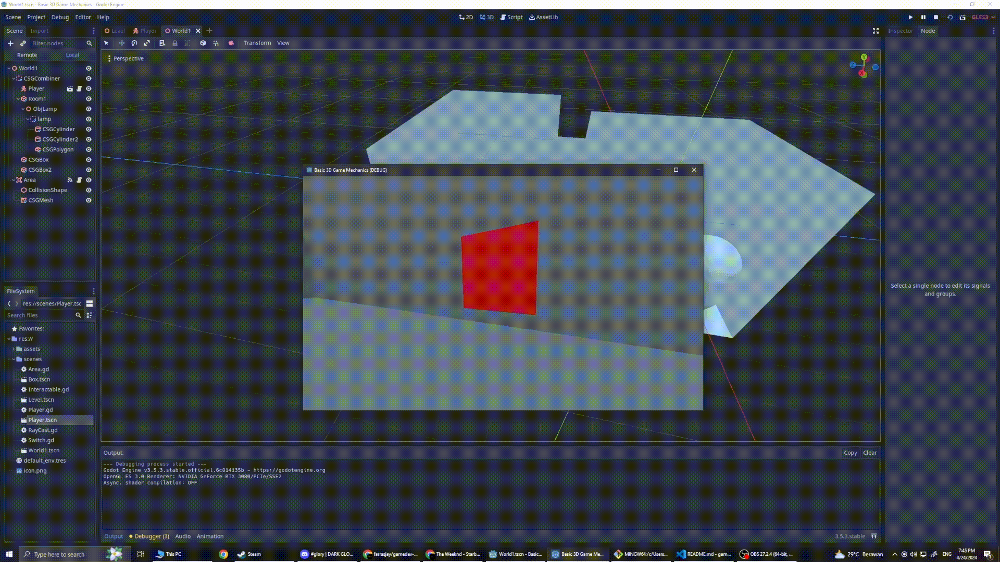
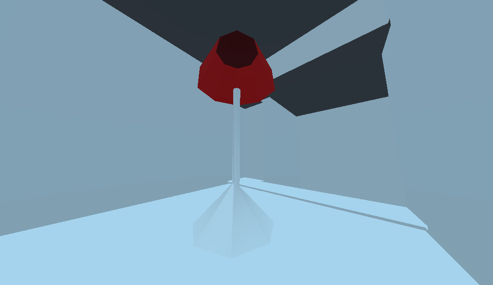
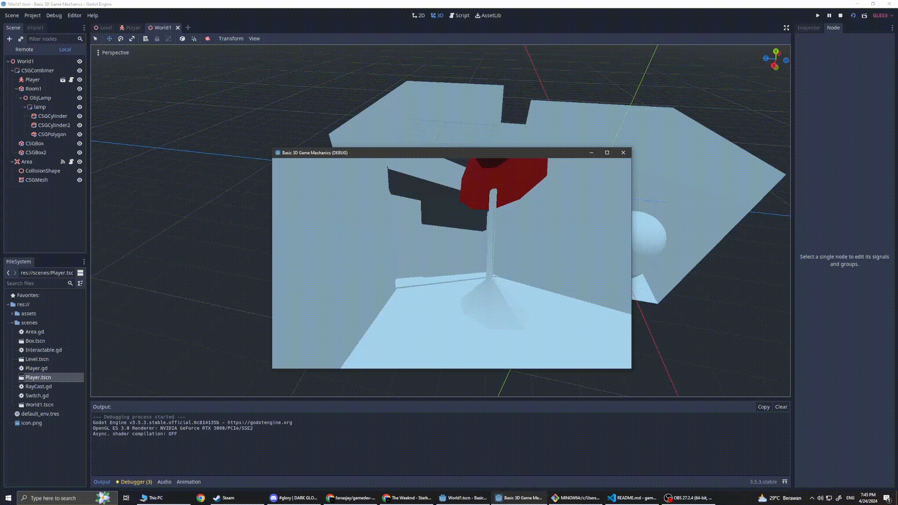

# Game Dev Tutorial 7

    <a href="https://github.com/sponsors/alexandresanlim">
        
            

                <h2>v3.5.3 LTS</h2>
            
  
    </a>

## 🗺️ Latihan : Interactables, Objects & Level Design 🗺️

- ### Interactables : Lamp Bulb

    > Lamp Bulb yang dapat dinyala matikan oleh player

    

- ### Static Object : Standing Lamp

    > Standing Lamp dari CSG nodes object yang dibentuk menyerupai standing lamp.

    

- ### Level Designs

    > Able to proceed to next level

    